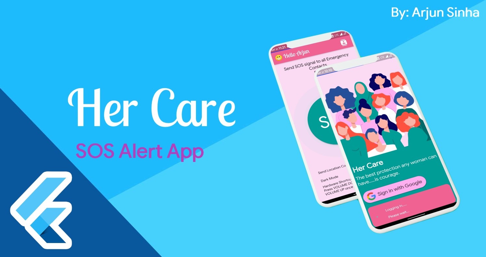
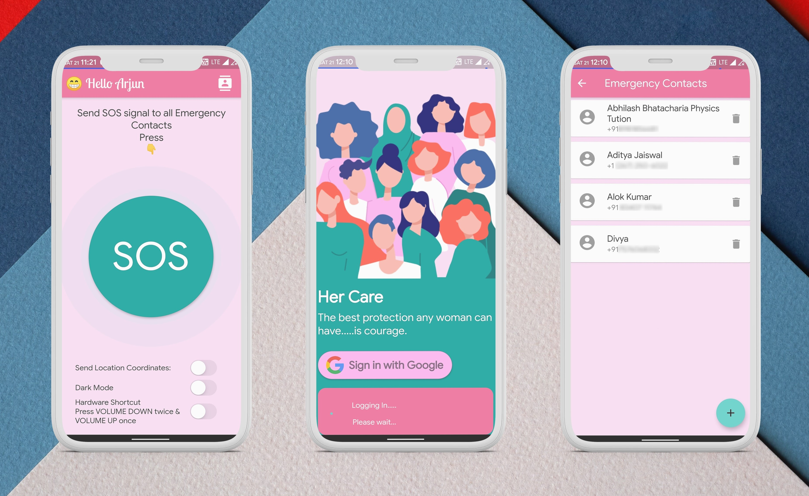

# Her-Care
-----------------------------------
An SOS Alert application to help send SMS alerts to the police and to your emergency contacts.

## The problem Her Care strives to solve
### Women safety is of paramount importance in today's society
------------------------------------------------
- Women nowadays are not safe to travel at night or in less urban areas due to various criminal activities.
- If they are threatened there is no single platform which they can use for help.
- There are a few applications to help them but none are very reliable.
- The people the woman will most look out for help is her close ones and the police.
- Our application helps solve this basic necessity which every girl should have.

### Our Solution
-------------------------------------------------
- I have developed an SOS platform to help women when they are in need of help: “Her Care”.
- The project consists of one mobile app and a web dashboard.
- Users/Women can use the app to send an SOS to the police and all their emergency contacts when feel threatened/distressed.
- The police can view all the SOS alerts on the web dashboard.
- The emergency contacts will receive the SOS in the form of a SMS with their coordinates.

## Screenshots
--------------------------------------------------

